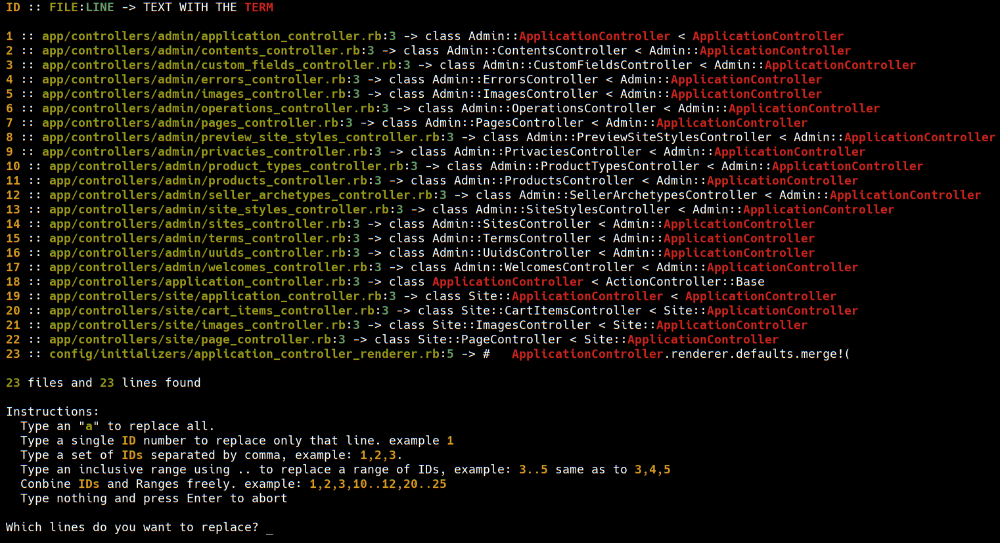

# Mvx (simple and extensible string replacer)

Mvx is a tool to provide simple string replacement to GIT controled projects, it is
a `sed` less powerfull but simpler.

## Motivation

Sometimes I wanted to perform some string replacement on several files, I used `sed` for this
but even though it works perfectly I missed some features like:

  - Filtering only git files `git ls-files`.
  - Visual preview of changes.
  - Be able to cherry pick which files / lines would be changed.

So because this I decided to create my own tool for this.



## Installation

Just download the binary in `bin/mvx` and add it to the path

```shell
wget https://raw.githubusercontent.com/andrewaguiar/mvx/master/bin/mvx
chmod +x mvx
```

Or clone the project and make the binary

```shell
git clone git@github.com:andrewaguiar/mvx.git
cd mvx
mix escript.build
```

Then add it to PATH

```shell
export PATH="$PATH:mvx_location"
```

## Usage

Type `mvx` to see instructions.

```shell
NAME
       mvx -- simple and powerfull string replacer based on non gitignore files

SYNOPSIS
       mvx <string-to-be-replaced> [replacement] [-r]

DESCRIPTION

       Mvx scans all git ls-files recursively and shows all occurences of <string-to-be-replaced> in each file, then it
       asks for confirmation before replace all occurrences by <replacement>.

       The following options are available:

       --filename | -f
              Filters by absolute path name in any part (defaults '').

              Example: "mvx AppController ApplicationController -f controllers" will consider only files with controllers
                       in absolute path like ("app/controllers/app_controllers.rb", "config/controllers.rb").

       --regex | -r
              Treats the <string-to-be-replaced> as a regex instead of a simple text (default false).
```

### Creating a bin

run `./make_dist` and the binary will be generated in `./bin`.
